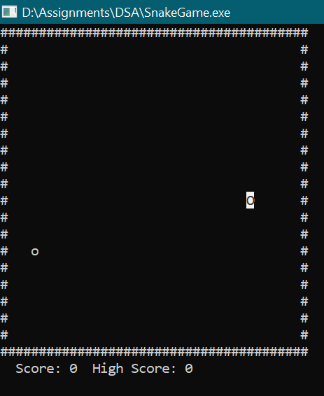

# Snake Game in C++

### Group Name: Pixels

 

### Student 1: Dia Pitroda  
### Student ID: 202404009  

 

### Student 2: Vadi Quincy Hiren  
### Student ID: 202401488  

 

### Student 3: Sania Debbarma  
### Student ID: 202404037  

 

## 📋 Table of Contents
- [Introduction](#introduction)
- [Game Components](#game-components)
  - [Snake Representation](#snake-representation)
  - [Food Generation](#food-generation)
  - [Game Board](#game-board)
  - [User Input and Movement](#user-input-and-movement)
- [Controls](#controls)
- [Collision Detection](#collision-detection)
- [Score Tracking](#score-tracking)
- [Game Loop and Logic](#game-loop-and-logic)
- [Screenshot](#screenshot)
- [Conclusion](#conclusion)
- [License](#license)

 

## 🐍 Introduction
The Snake game is a classic arcade game where the player controls a snake that grows in length by consuming food. The challenge lies in avoiding collisions with the wall or the snake's own body. As the snake grows, movement becomes more difficult, creating an engaging gameplay experience.

 

## 🧩 Game Components

### 🧱 Snake Representation
The snake is implemented as a linked list, where each node contains the `(x, y)` coordinates of one segment. The head node represents the snake's current position. New nodes are added as the snake eats food.

 

### 🍎 Food Generation
Food is randomly spawned on the board at empty spaces, ensuring it doesn't overlap with the snake. When the snake eats food, it grows longer and a new food item is generated at a new random location.

 

### 🗺️ Game Board
The board defines the play area and is bounded. The snake must stay within this area. Hitting the boundary is considered a collision and ends the game. The board size can be customized to adjust difficulty.

 

### 🎮 User Input and Movement
Players control the snake using directional inputs. The snake continuously moves in the current direction until a new input is received. Reverse movement (like left to right instantly) is disallowed to prevent self-collisions.

 

## 🕹️ Controls

The following keys are used to control the game:

- **L**: Move Left  
- **R**: Move Right  
- **U**: Move Up  
- **D**: Move Down  
- **T**: Terminate the game

 

## 💥 Collision Detection
The game ends when:
- The snake hits the board boundaries.
- The snake collides with its own body.

Collision detection logic ensures the game gets progressively harder as the snake grows, increasing the risk of self-collision.

 

## 🧮 Score Tracking
The player's score increases each time the snake consumes food. The longer the snake grows, the higher the score. This creates an incentive to survive longer and improve performance.

 

## 🔁 Game Loop and Logic

The main game loop performs the following tasks:

1. **Render** the board, snake, and food  
2. **Capture user input** for directional control  
3. **Update the snake's position**, grow if food is consumed  
4. **Check for collisions**  
5. **Repeat** the above steps until the game ends or is manually terminated

 

## 📸 Screenshot

Below is an image of the game in action:

  
*Snake game running with a score of 4 before game over.*

 

## ✅ Conclusion

The Snake game is a great project for learning:
- Data structures like linked lists  
- Input and event handling  
- Basic game loop logic  
- Collision detection

It provides a strong foundation for beginners and can be enhanced with new features like levels, power-ups, or even multiplayer support.

 

## 📄 License

This project is released under the **MIT License**, meaning:
- You can use, modify, and distribute the code freely  
- Just remember to credit the original authors

 
